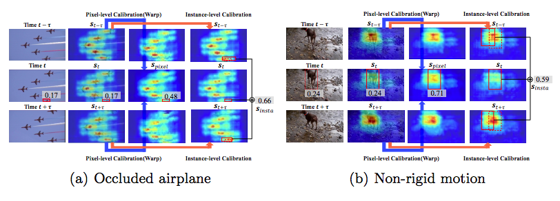
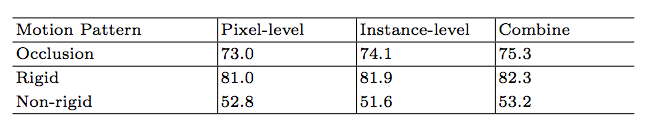

# Fully Motion-Aware Network for Video Object Detection


This implementation is a fork of [FGFA](https://github.com/msracver/Flow-Guided-Feature-Aggregation) and extended by [Shiyao Wang](https://github.com/wangshy31) through adding instance-level aggregation and motion pattern reasoning.


## Introduction

**Fully Motion-Aware Network for Video Object Detection (MANet)** is initially described in an [ECCV 2018 paper](https://wangshy31.github.io/papers/2-MANet.pdf). It proposes an end-to-end model called fully motion-aware network (MANet), which jointly calibrates the features of objects on both pixel-level and instance-level in a unified framework.

The contributions of this paper include:

* Propose an instance-level feature calibration method by learning instance movements through time. The instance-level calibration is more robust to occlusions and outperforms pixel-level feature calibration.
* Develop a motion pattern reasoning module to dynamically combine pixel-level and instance-level calibration according to the motion.
* Demonstrate the MANet on the large-scale [ImageNet VID dataset](http://image-net.org/challenges/LSVRC/) with state-of-the-art performance.


## Installation

1. Clone the repo, and we call the directory that you cloned as ${MANet_ROOT}.
	```
	git clone https://github.com/wangshy31/MANet_for_Video_Object_Detection.git
	```
2. Python packages might missing: cython, opencv-python >= 3.2.0, easydict. If `pip` is set up on your system, those packages should be able to be fetched and installed by running
	```
	pip install Cython
	pip install opencv-python==3.2.0.6
	pip install easydict==1.6
	```
3. Run `sh ./init.sh` to build cython module automatically and create some folders.

4. Install MXNet as [FGFA](https://github.com/msracver/Flow-Guided-Feature-Aggregation):

   4.1 Clone MXNet and checkout to [MXNet@(v0.10.0)](https://github.com/apache/incubator-mxnet/tree/v0.10.0) by

   ```
   git clone --recursive https://github.com/apache/incubator-mxnet.git
   cd incubator-mxnet
   git checkout v0.10.0
   git submodule update
   ```

   We also provide a [repo](https://github.com/wangshy31/mxnet.git) that contains mxnet configured as required.

   4.2 Copy operators in `$(MANet_ROOT)/manet_rfcn/operator_cxx` to `$(YOUR_MXNET_FOLDER)/src/operator/contrib` by

   ```cp -r $(MANet_ROOT)/manet_rfcn/operator_cxx/* $(MXNET_ROOT)/src/operator/contrib/```

   4.3 Compile MXNet

   ```
   cd ${MXNET_ROOT}
   make -j4
   ```
   4.4 Install the MXNet Python binding by
   ```
   cd python
   sudo python setup.py install
   ```


## Preparation for Training & Testing

**For data processing**: 

1. Please download ILSVRC2015 DET and ILSVRC2015 VID dataset, and make sure it looks like this:

   ```
   ./data/ILSVRC2015/
   ./data/ILSVRC2015/Annotations/DET
   ./data/ILSVRC2015/Annotations/VID
   ./data/ILSVRC2015/Data/DET
   ./data/ILSVRC2015/Data/VID
   ./data/ILSVRC2015/ImageSets
   ```

2. Please download ImageNet pre-trained ResNet-v1-101 model and Flying-Chairs pre-trained FlowNet model manually from [OneDrive](https://1drv.ms/u/s!Am-5JzdW2XHzhqMOBdCBiNaKbcjPrA), and put it under folder `./model`. Make sure it looks like this:

   ```
   ./model/pretrained_model/resnet_v1_101-0000.params
   ./model/pretrained_model/flownet-0000.params
   ```

**For training & testing**: 

1. Three-phase training is performed on the mixture of ImageNet DET+VID which is useful for the final performance. 

   ​	**Phase 1**: Fix the weights of ResNet, combine pixel-level aggregated features and instance-level 		aggregated features by average operation. See script/train/phase-1;

   ​	**Phase 2**: Similar to phase 1 but joint train ResNet. See script/train/phase-2;

   ​	**Phase 3**: Fix the weights of ResNet, change the average operation to learnable weights and sample more VID data. See script/train/phase-3;

   We use 4 GPUs to train models on ImageNet VID. Any NVIDIA GPUs with at least 8GB memory should be OK.

2. To perform experiments, run the python script with the corresponding config file as input. For example, to train and test MANet with R-FCN, use the following command

   ```
   ./run.sh
   ```

   A cache folder would be created automatically to save the model and the log under 

   `imagenet_vid/`.

3. Please find more details in config files and in our code.

## Main Results

1. We conduct an ablation study so as to validate the effectiveness of the proposed network.


**Table 1**. Accuracy of different methods on ImageNet VID validation, using ResNet-101 feature extraction networks. Detection accuracy of slow (motion IoU > 0.9), medium (0.7 ≤ motion IoU ≤ 0.9), and fast (motion IoU < 0.7) moving object instances.

2. We attempt to take a deeper look at detection results and prove that two calibrated features have respective strengths.



**Figure 1**. Visualization of two typical examples: occluded and non-rigid objects. They show respective strengths of the two calibration methods.



**Table 2**. Statistical analysis on different validation sets. The instance-level calibration is better when objects are occluded or move more regularly while the pixel-level calibration performs well on non-rigid motion. Combination of these two module can achieve best performance.


## Download Trained Models
You can download the trained MANet from [drive](https://drive.google.com/file/d/1tKFfOKaFUeZanKTCCwVw-xaKu0wAw71t/view?usp=sharing). It can achieve 78.03% mAP without sequence-level post-processing (e.g., SeqNMS).


## Citing MANet

If you find Fully Motion-Aware Network for Video Object Detection useful in your research, please consider citing:
```
@inproceedings{wang2018fully,
    Author = {Wang, Shiyao and Zhou, Yucong and Yan, Junjie and Deng, Zhidong},
    Title = {Fully Motion-Aware Network for Video Object Detection},
    booktitle={Proceedings of the European Conference on Computer Vision (ECCV)},
    pages={542--557},
    Year = {2018}
}

```


